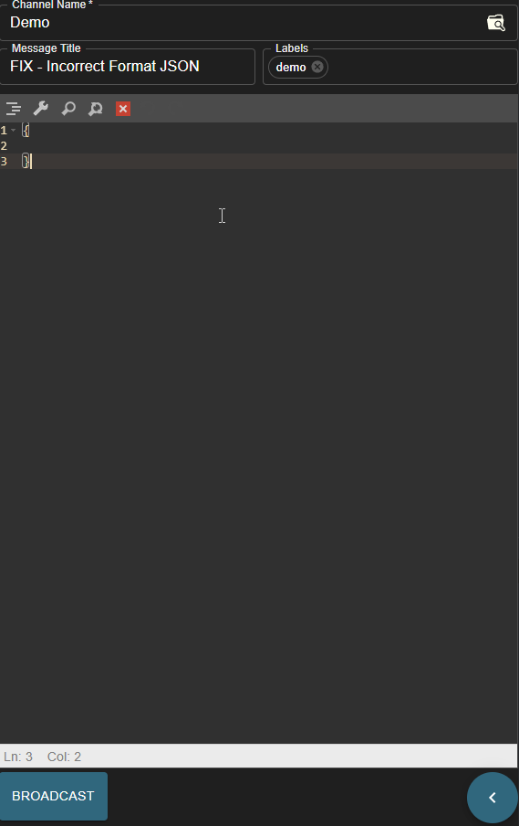
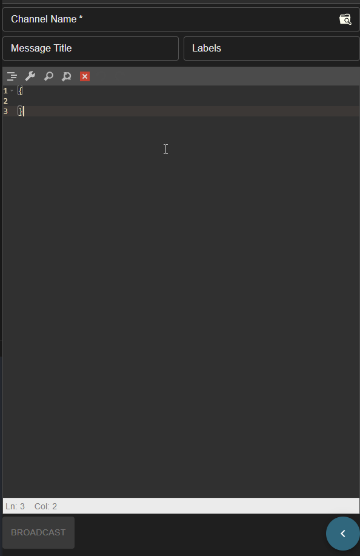

# CMAPI Shouter 

CMAPI Shouter is a single-page application developed using React. The purpose of this project is to organize and format messages in CMAPI standard and broadcast them to maps via OWF or HTML5 interfaces.

CMAPI stands for Common Map API. It's a standardized approach that allows web applications from different organizations to visualize and interact with data on a shared map view. This promotes interoperability and portability, meaning applications can easily exchange data and work together without relying on specific map implementations. Visit [cmapi.org](https://cmapi.org/index.html) for detailed information.

OWF stands for OZONE Widget Framework. It is a framework that allows data from different servers to communicate inside a browser window without sending information back to the respective servers. This unique capability allows the OWF web portal to offer decentralized data manipulation. It includes a secure, in-browser, pub-sub eventing system which allows widgets from different domains to share information. Visit [owf-framework Github Page](https://github.com/ozoneplatform/owf-framework) for detailed information.

### Demo


### Features

* Supports OWF and HTML5 messaging interfaces.

* Automatic formatting, search, replace, clear, undo, and redo for JSON messages with a built-in JSON editor.



* Integrates with the [CMAPI Bucket](https://github.com/Aknbb/cmapi-bucket) application, allowing it to fetch messages hosted in the [CMAPI Bucket](https://github.com/Aknbb/cmapi-bucket) on startup and enabling their usage.

* Facilitates updating, deleting, and adding new messages in the [CMAPI Bucket](https://github.com/Aknbb/cmapi-bucket) application. This feature requires authentication information.

* Allows searching among messages.

* Enables adding TAGs to messages to be saved in the [CMAPI Bucket](https://github.com/Aknbb/cmapi-bucket), making it easy to find the relevant message by searching for the TAG.



* Optionally, remembers authentication information for 6 hours by storing it in the cookie.

### Getting Started

To run the application, follow these steps:

1. **Clone the cmapi-shouter repository from GitHub:**

    ```
       git clone https://github.com/Aknbb/cmapi-shouter.git
    ```

2. **Install the dependencies:**

   1. Navigate to project directory.
   
        ```
        cd cmapi-shouter
        ```   
      
   2. Install the dependencies.
   
        ```
        npm install
         ```
3. **Update Config File (Optional):**

    If you are going to use it with [CMAPI Bucket](https://github.com/Aknbb/cmapi-bucket), you can establish a connection by replacing the URL named **REST_ENTRY_POINT** in the **config.json** file under the public folder with your [CMAPI Bucket](https://github.com/Aknbb/cmapi-bucket) address.
    
    ```
    {
      "REST_ENTRY_POINT": "http://localhost:8080"
    }
     ```
    
4. **Run / Build:**

    1. To start the application locally, execute the following command. The application will run on port 3000 and you can access it at http://localhost:3000
    
         ```
            npm run start
         ```
         
    2. To build the application, execute the following command. The **build** folder will be created under the project directory. The contents of this folder can be transferred to the server that will serve it.
    
         ```
            npm run build
         ```
    
### License

This project is licensed under the [MIT License](LICENSE).

#### Contact
Feel free to explore my CMAPI Shouter project and get in touch if you have any questions or collaboration ideas. You can reach out to me via [akinbuyukbulut@gmail.com](mailto:akinbuyukbulut@gmail.com) or connect with me on [LinkedIn](https://www.linkedin.com/in/akinbuyukbulut/) and [GitHub](https://github.com/Aknbb).
